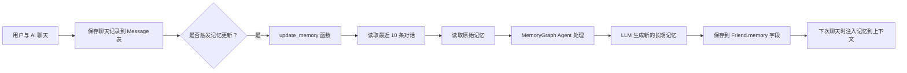

```mermaid 

graph LR
    A[用户与 AI 聊天] --> B[保存聊天记录到 Message 表]
    B --> C{是否触发记忆更新？}
    C -->|是 | D[update_memory 函数]
    D --> E[读取最近 10 条对话]
    E --> F[读取原始记忆]
    F --> G[MemoryGraph Agent 处理]
    G --> H[LLM 生成新的长期记忆]
    H --> I[保存到 Friend.memory 字段]
    I --> J[下次聊天时注入记忆到上下文]

```